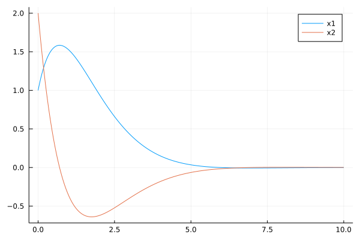

# FlightSims
`FlightSims` is a general-purpose numerical simulator by defining nested environments.
This package can be used for any kind of numerical simulation with dynamical systems
although it was supposed to be dedicated only for flight simulations.

## Features
### Compatibility
- It is compatible with [OrdinaryDiffEq.jl](https://github.com/SciML/OrdinaryDiffEq.jl).
Supporting full compatibility with [DifferentialEquations.jl](https://github.com/SciML/DifferentialEquations.jl) is not on the road map for now.
If you want more functionality, please feel free to report an issue!
### Nested Environments and Zoo
- One can generate user-defined nested environments (or, dynamical systems) for complex flight simulation.
Also, some predefined environments are provided for reusability (i.e., environment zoo).
Take a look at `src/environments`.
### Utilities
- Some utilities are also provided, for example, calculation of polynomial basis and 3D rotation.
Take a look at `src/utils`.

## APIs
Main APIs are provided in `src/APIs`.
### Make an environment
- `AbstractEnv`: an abstract type for user-defined and predefined environments.
All environment structures should be sub-type of `AbstractEnv`.
- `State(env::AbstractEnv)`: return a function that produces structured states.
- `dynamics!(env::AbstractEnv)` and `dynamics(env::AbstractEnv)`: return a function that maps in-place (**recommended**) and out-of-place dynamics (resp.),
compatible with `DifferentialEquations`. User can extend these methods or simply define other methods.
- `apply_inputs(func; kwargs...)`: It is borrowed from [an MRAC example](https://jonniedie.github.io/ComponentArrays.jl/stable/examples/adaptive_control/). By using this, user can easily apply various kind of inputs into the dynamical system (environment).

### Simulation and data saving & loading
- [ ] To-do: Fill the following contents.
- `sim`: return `prob::ODEProblem` and `sol::ODESolution`.
- `process`: process `prob` and `sol` to get simulation data.
- `save`: save `env`, `prob`, `sol`, and optionally `process`,
in a `.jld2` file.
- `load`: load `env`, `prob`, `sol`, and optionally `process`,
from a `.jld2` file.

## Usage
### Control and reinforcement learning with dynamical systems
- For an example of **infinite-horizon continuous-time linear quadratic regulator (LQR)**, see the following example code (`test/lqr.jl`).

```julia
using FlightSims
using LinearAlgebra
using ControlSystems: lqr
using Plots


function test()
    # double integrator
    n, m = 2, 1
    A = [0 1;
         0 0]
    B = [0;
         1]
    Q = Matrix(I, n, n)
    R = Matrix(I, m, m)
    env = LinearSystemEnv(A, B, Q, R)  # exported from FlightSims
    K = lqr(A, B, Q, R)
    x0 = State(env)([1, 2])
    u_lqr(x, p, t) = -K*x
    prob, sol = sim(
                    x0,  # initial condition
                    apply_inputs(dynamics!(env); u=u_lqr);  # dynamics with input of LQR
                    tf=10.0,  # final time
                   )
    df = process(env)(prob, sol; Δt=0.01)  # DataFrame; `Δt` means data sampling period.
    plot(df.times, hcat(df.states...)'; label=["x1" "x2"])  # Plots
end
```


- For an example of **continuous-time value-iteration adaptive dynamic programming (CT-VI-ADP)**, take a look at `main/continuous_time_vi_adp.jl`.
    - [T. Bian and Z.-P. Jiang, “Value Iteration, Adaptive Dynamic Programming, and Optimal Control of Nonlinear Systems,” in 2016 IEEE 55th Conference on Decision and Control (CDC), Las Vegas, NV, USA, Dec. 2016, pp. 3375–3380. doi: 10.1109/CDC.2016.7798777.](https://ieeexplore.ieee.org/document/7798777)
### Scientific machine learning
- For an example usage of [Flux.jl](https://github.com/FluxML/Flux.jl), see `main/flux_example.jl`.
- For an example code of an imitation learning algorithm, behavioural cloning, see `main/behavioural_cloning.jl`.

## Issues
- [An issue](https://github.com/jonniedie/ComponentArrays.jl/issues/83)
has been reported; unknown crash between `OrdinaryDiffEq` and `ComponentArrays`.
Will be resolved by [this](https://github.com/jonniedie/ComponentArrays.jl/commit/0a6f1cfe41131a6b0ff2d26ad6bad5bc33f19671).
