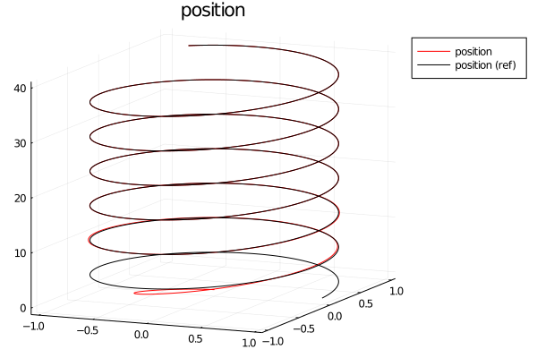

# FlightSims
`FlightSims` is a general-purpose numerical simulator by defining nested environments.
## Why is it `FlightSims`?
This package is for any kind of numerical simulation with dynamical systems
although it was supposed to be dedicated for flight simulations.

## Features
### Compatibility
- It is highly based on [OrdinaryDiffEq.jl](https://github.com/SciML/OrdinaryDiffEq.jl).
Supporting full compatibility with [DifferentialEquations.jl](https://github.com/SciML/DifferentialEquations.jl) is not on the road map for now.
- The construction of nested environments are based on [ComponentArrays.jl](https://github.com/jonniedie/ComponentArrays.jl).

If you want more functionality, please feel free to report an issue!

### Nested Environments and Zoo
- Environments usually stand for **dynamical systems** but also contain **other utilities**, for example, controllers.
- One can generate user-defined nested environments using provided APIs.
Also, some predefined environments are provided for reusability (i.e., environment zoo).
Take a look at `src/environments`.
- Examples include
    - **basics**
        - (Linear system) `LinearSystemEnv`
        - (Reference model) `ReferenceModelEnv`
        - (Nonlinear system) `TwoDimensionalNonlinearPolynomialEnv`
            - [T. Bian and Z.-P. Jiang, “Value Iteration, Adaptive Dynamic Programming, and Optimal Control of Nonlinear Systems,” in 2016 IEEE 55th Conference on Decision and Control (CDC), Las Vegas, NV, USA, Dec. 2016, pp. 3375–3380. doi: 10.1109/CDC.2016.7798777.](https://ieeexplore.ieee.org/document/7798777)
    - **multicopters**
        - (Quadcopter) `IslamQuadcopterEnv`, `GoodarziQuadcopterEnv`
        - (Hexacopter) `LeeHexacopterEnv`
    - **controllers**
        - (Linear quadratic regulator) `LQR`
        - (Backstepping controller) `BacksteppingPositionControllerEnv`
    - **integrated_environments**
        - See `src/environments/integrated_environments`.
    - others
        - (Actuator fault) `LoE`

### Utilities
- Some utilities are also provided for dynamical system simulation.
- Examples include
    - **Function approximator**
        - (Approximator) `LinearApproximator`, `PolynomialBasis`
    - **Data manipulation for machine learning**
        - (Split data) `partitionTrainTest`
    - **Reference trajectory generator**
        - (Command generator) `HelixCommandGenerator`, `PowerLoop`
    - **Ridig body rotation**
        - (Rotations) `euler`

## APIs
Main APIs are provided in `src/APIs`.
Note that among APIs, **a function whose output is a function** will have the uppercase first letter ([#55](https://github.com/JinraeKim/FlightSims.jl/issues/55)).

### Make an environment
- `AbstractEnv`: an abstract type for user-defined and predefined environments.
In general, environments is a sub-type of `AbstractEnv`.
- `State(env::AbstractEnv)`: return a function that produces structured states.
- `Dynamics!(env::AbstractEnv)`, `Dynamics(env::AbstractEnv)`: return a function that maps in-place (**recommended**) and out-of-place dynamics (resp.),
compatible with [DifferentialEquations.jl](https://github.com/SciML/DifferentialEquations.jl). User can extend these methods or simply define other methods.
- `apply_inputs(func; kwargs...)`: It is borrowed from [an MRAC example of ComponentArrays.jl](https://jonniedie.github.io/ComponentArrays.jl/stable/examples/adaptive_control/). By using this, user can easily apply various kind of inputs into the environment.

Note that these interfaces are also provided for some **integrated environments**, e.g., `State(system, controller)`.

### Simulation and data saving & loading
- `sim`: return `prob::DEProblem` and `sol::DESolution`.
    - With a keyword argument `datum_format`, it results `prob`, `sol`, and `df::DataFrame`.
- `DatumFormat(env::AbstractEnv)`: return a function `(x, t, integrator::DiffEqBase.DEIntegrator) -> nt::NamedTuple` for saving data.
    - It is recommended users to use `DatumFormat(env::AbstractEnv)` for saving **basic information** of `env`.
    - Default setting: time and state histories will be saved as `df.time` and `df.state`.
- `save_inputs(func; kwargs...)`: this mimics `apply_inputs(func; kwargs...)`.
    - It is recommended users to use `save_inputs(func; kwargs...)` for saving **additional information**.
- `Process(env::AbstractEnv)`: return a function that processes `prob` and `sol` to get simulation data.
    - It is recommended users to use `Process(env::AbstractEnv)` when the simulation is **deterministic** (including parameter updates).
- `save`: save `env`, `prob`, `sol`, and optionally `process`,
    - Not actively maintained. Please report issues about new features of saving data.
in a `.jld2` file.
- `load`: load `env`, `prob`, `sol`, and optionally `process`,
from a `.jld2` file.
    - Not actively maintained. Please report issues about new features of loading data.

## Usage
### Optimal control and reinforcement learning
- For an example of **infinite-horizon continuous-time linear quadratic regulator (LQR)**,
see the following example code (`test/lqr.jl`).

```julia
using FlightSims
const FS = FlightSims
using LinearAlgebra
using Plots


function test()
    # linear system
    A = [0 1;
         0 0]
    B = [0;
         1]
    n, m = 2, 1
    env = LinearSystemEnv(A, B)  # exported from FlightSims
    x0 = State(env)([1.0, 2.0])
    # optimal control
    Q = Matrix(I, n, n)
    R = Matrix(I, m, m)
    lqr = LQR(A, B, Q, R)  # exported from FlightSims
    u_lqr = FS.OptimalController(lqr)  # (x, p, t) -> -K*x; minimise J = ∫ (x' Q x + u' R u) from 0 to ∞
    # simulation
    t0, tf = 0.0, 10.0
    Δt = 0.01  # save period; not simulation time step
    # case 1: processing data simultaneously
    prob, sol, df = sim(
                        x0,  # initial condition
                        apply_inputs(Dynamics!(env); u=u_lqr);  # dynamics with input of LQR
                        t0=t0, tf=tf,  # final time
                        datum_format=save_inputs(DatumFormat(env); input=u_lqr),  # saving data; default key: time, state
                        saveat=t0:Δt:tf,
                       )
    # case 2: processing data after simulation
    # df = Process(env)(prob, sol; Δt=0.01)  # DataFrame; `Δt` means data sampling period.
    plot(df.time, hcat(df.state...)'; title="state variable", label=["x1" "x2"])  # Plots
    savefig("figures/x_lqr.png")
    plot(df.time, hcat(df.input...)'; title="control input", label="u")  # Plots
    savefig("figures/u_lqr.png")
end
```


- For an example of **continuous-time value-iteration adaptive dynamic programming (CT-VI-ADP)**, take a look at `test/continuous_time_vi_adp.jl`.
    - [T. Bian and Z.-P. Jiang, “Value Iteration, Adaptive Dynamic Programming, and Optimal Control of Nonlinear Systems,” in 2016 IEEE 55th Conference on Decision and Control (CDC), Las Vegas, NV, USA, Dec. 2016, pp. 3375–3380. doi: 10.1109/CDC.2016.7798777.](https://ieeexplore.ieee.org/document/7798777)
- For an example of **continuous-time integral reinforcement learning for linear system (CT-IRL)**, take a look at `test/continuous_time_linear_irl.jl`.
    - [F. L. Lewis, D. Vrabie, and K. G. Vamvoudakis, “Reinforcement Learning and Feedback Control: Using Natural Decision Methods to Design Optimal Adaptive Controllers,” IEEE Control Syst., vol. 32, no. 6, pp. 76–105, Dec. 2012, doi: 10.1109/MCS.2012.2214134.](https://d1wqtxts1xzle7.cloudfront.net/55631024/06315769.pdf?1516876343=&response-content-disposition=inline%3B+filename%3DUsing_natUral_decision_methods_to_design.pdf&Expires=1623395195&Signature=LP3BHxKg2mtIkqNFrR2C3NOOfxIxK6efgoHlXKFMH~IPjBL-Mi9CydRIhrqXQKOugpEaNAQR76H00mcz11ZoUbtTUUowVVWhYGk3iMK8aR~lUxO9b0A47iiJohLr6YpWhGm5AAgEDcKXa8DKFTAheBjGqTgFjL1Qm23MXlSXjWwR7DRhk5QtfiKjOQephv6c50CLinZxbz-VygOFTxuelbLcphrxuszszCVLZtS0K0sH~3f9RZkIJcNKqe8t18ghkHxfSZTapae0AZSslGaGLjBlbqF9RSCc04eQZorZmHxvrYd4CZ0Zac7Hn3M3--Qe81tL-32ULl~XLYk1Q5Ev4A__&Key-Pair-Id=APKAJLOHF5GGSLRBV4ZA)

### Nonlinear control
- For an example of **backstepping position tracking controller for quadcopters**,
see the following example code (`main/backstepping_tracking.jl`).
```julia
using FlightSims
const FS = FlightSims
using UnPack, ComponentArrays
using Transducers
using Plots


function make_env()
    multicopter = IslamQuadcopterEnv()
    @unpack m, g, B = multicopter
    mixer = PseudoInverseMixer(multicopter.B)
    x0_multicopter = State(multicopter)()
    pos0 = copy(x0_multicopter.p)
    vel0 = copy(x0_multicopter.v)
    helixCG = FS.HelixCommandGenerator(pos0)
    cg = command_generator(helixCG)
    controller = BacksteppingPositionControllerEnv(m; x_cmd_func=cg)
    x0_controller = State(controller)(pos0, m, g)
    x0 = ComponentArray(multicopter=x0_multicopter, controller=x0_controller)
    multicopter, controller, mixer, x0, cg
end

function main()
    multicopter, controller, mixer, x0, cg = make_env()
    prob, sol = sim(x0, Dynamics!(multicopter, controller, mixer); tf=40.0)
    t0, tf = prob.tspan
    Δt = 0.01  # data sampling period; not simulation time step
    ts = t0:Δt:tf
    poss = ts |> Map(t -> sol(t).multicopter.p) |> collect
    poss_ref = ts |> Map(t -> cg(t)) |> collect
    ## plot
    # 3d traj
    p_traj = plot3d(; title="position", legend=:outertopright)
    plot!(p_traj, hcat(poss...)'[:, 1], hcat(poss...)'[:, 2], hcat(poss...)'[:, 3]; label="position", color="red")
    plot!(p_traj, hcat(poss_ref...)'[:, 1], hcat(poss_ref...)'[:, 2], hcat(poss_ref...)'[:, 3]; label="position (ref)", color="black")
    savefig(p_traj, "traj.png")
end
```


### Scientific machine learning
- [ ] Add examples for newbies!
- For an example usage of [Flux.jl](https://github.com/FluxML/Flux.jl), see `main/flux_example.jl`.
- For an example code of an imitation learning algorithm, behavioural cloning, see `main/behavioural_cloning.jl`.
