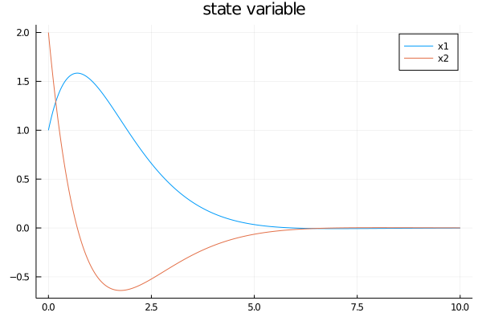
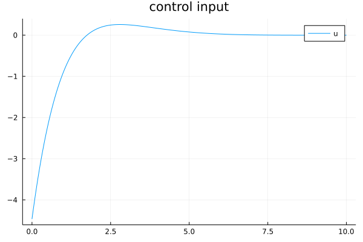
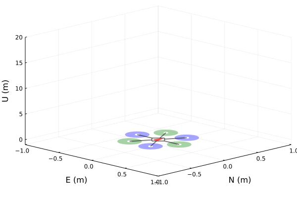

# FlightSims
[FlightSims.jl](https://github.com/JinraeKim/FlightSims.jl) is a general-purpose numerical simulator supporting nested environments and convenient macro-based data logging.

## Road map
- [ ] ROS2 compatibility (not urgent)

## NEWS
- See [NEWS.md](./NEWS.md).


## APIs
Main APIs can be found in [FSimBase.jl](https://github.com/JinraeKim/FSimBase.jl).
In FlightSims.jl, the default differential equation (DE) solver is [`Tsit5()`](https://diffeq.sciml.ai/stable/#Solver-Algorithms) for ordinary DE (ODE).

## Features
If you want more functionality, please feel free to report an issue!

### Nested Environments and Zoo
- Environments usually stand for **dynamical systems** but also include **other utilities**, for example, controllers.
- One can generate user-defined nested environments using provided APIs.
Also, some predefined environments are provided for reusability.
Take a look at [FSimZoo.jl](https://github.com/JinraeKim/FSimZoo.jl).

### Utilities
- Some utilities are also provided for dynamical system simulation.
- Examples include
    - **Simulation rendering**
        - See [FSimPlots.jl](https://github.com/JinraeKim/FSimPlots.jl).
    <!-- - **Function approximator** -->
    <!--     - (Approximator) `LinearApproximator`, `PolynomialBasis` -->
    - **Data manipulation for machine learning**
        - (Split data) `partitionTrainTest`


## Examples
### Basic: minimal examples
- For minimal examples of FlightSims.jl,
see [FSimBase.jl](https://github.com/JinraeKim/FSimBase.jl).

### Optimal control and reinforcement learning
- For an example of **infinite-horizon continuous-time linear quadratic regulator (LQR)**,
see the following example code (`test/lqr.jl`).

```julia
using FlightSims
const FS = FlightSims
using DifferentialEquations
using LinearAlgebra
using Plots
using Test
using Transducers


function test()
    # linear system
    A = [0 1;
         0 0]  # 2 x 2
    B = [0 1]'  # 2 x 1
    n, m = 2, 1
    env = LinearSystemEnv(A, B)  # exported from FlightSims
    x0 = State(env)([1.0, 2.0])
    p0 = zero.(x0)  # auxiliary parameter
    # optimal control
    Q = Matrix(I, n, n)
    R = Matrix(I, m, m)
    lqr = LQR(A, B, Q, R)  # exported from FlightSims
    u_lqr = Command(lqr)  # (x, p, t) -> -K*x; minimise J = ∫ (x' Q x + u' R u) from 0 to ∞

    # simulation
    tf = 10.0
    Δt = 0.01
    affect!(integrator) = integrator.p = copy(integrator.u)  # auxiliary callback funciton
    cb = PeriodicCallback(affect!, Δt; initial_affect=true)  # auxiliary callback
    @Loggable function dynamics!(dx, x, p, t)
        @onlylog p  # activate this line only when logging data
        u = u_lqr(x)
        @log x, u
        @nested_log Dynamics!(env)(dx, x, p, t; u=u)  # exported `state` and `input` from `Dynamics!(env)`
    end
    prob, df = sim(
                   x0,  # initial condition
                   dynamics!,  # dynamics with input of LQR
                   p0;
                   tf=tf,  # final time
                   callback=cb,
                   savestep=Δt,
                  )
    ts = df.time
    xs = df.sol |> Map(datum -> datum.x) |> collect
    us = df.sol |> Map(datum -> datum.u) |> collect
    ps = df.sol |> Map(datum -> datum.p) |> collect
    states = df.sol |> Map(datum -> datum.state) |> collect
    inputs = df.sol |> Map(datum -> datum.input) |> collect
    @test xs == states
    @test us == inputs
    p_x = plot(ts, hcat(states...)';
               title="state variable", label=["x1" "x2"], color=[:black :black], lw=1.5,
              )  # Plots
    plot!(p_x, ts, hcat(ps...)';
          ls=:dash, label="param", color=[:red :orange], lw=1.5
         )
    savefig("figures/x_lqr.png")
    plot(ts, hcat(inputs...)'; title="control input", label="u")  # Plots
    savefig("figures/u_lqr.png")
    df
end
```

```julia
julia> test()
1001×2 DataFrame
  Row │ time     sol
      │ Float64  NamedTup…
──────┼────────────────────────────────────────────
    1 │    0.0   (p = [1.01978, 1.95564], state =…
    2 │    0.01  (p = [1.01978, 1.95564], state =…
    3 │    0.02  (p = [1.03911, 1.91186], state =…
    4 │    0.03  (p = [1.05802, 1.86863], state =…
    5 │    0.04  (p = [1.07649, 1.82596], state =…
  ⋮   │    ⋮                     ⋮
  998 │    9.97  (p = [-0.00093419, 0.00103198], …
  999 │    9.98  (p = [-0.000923913, 0.00102347],…
 1000 │    9.99  (p = [-0.00091372, 0.001015], st…
 1001 │   10.0   (p = [-0.00091372, 0.001015], st…
                                   992 rows omitted
```




- (Deprecated; will be detached) ~~For an example of **continuous-time value-iteration adaptive dynamic programming (CT-VI-ADP)**, take a look at `test/continuous_time_vi_adp.jl`.~~
    - [T. Bian and Z.-P. Jiang, “Value Iteration, Adaptive Dynamic Programming, and Optimal Control of Nonlinear Systems,” in 2016 IEEE 55th Conference on Decision and Control (CDC), Las Vegas, NV, USA, Dec. 2016, pp. 3375–3380. doi: 10.1109/CDC.2016.7798777.](https://ieeexplore.ieee.org/document/7798777)
- (Deprecated; will be detached) ~~For an example of **continuous-time integral reinforcement learning for linear system (CT-IRL)**, take a look at `test/continuous_time_linear_irl.jl`.~~
    - [F. L. Lewis, D. Vrabie, and K. G. Vamvoudakis, “Reinforcement Learning and Feedback Control: Using Natural Decision Methods to Design Optimal Adaptive Controllers,” IEEE Control Syst., vol. 32, no. 6, pp. 76–105, Dec. 2012, doi: 10.1109/MCS.2012.2214134.](https://d1wqtxts1xzle7.cloudfront.net/55631024/06315769.pdf?1516876343=&response-content-disposition=inline%3B+filename%3DUsing_natUral_decision_methods_to_design.pdf&Expires=1623395195&Signature=LP3BHxKg2mtIkqNFrR2C3NOOfxIxK6efgoHlXKFMH~IPjBL-Mi9CydRIhrqXQKOugpEaNAQR76H00mcz11ZoUbtTUUowVVWhYGk3iMK8aR~lUxO9b0A47iiJohLr6YpWhGm5AAgEDcKXa8DKFTAheBjGqTgFjL1Qm23MXlSXjWwR7DRhk5QtfiKjOQephv6c50CLinZxbz-VygOFTxuelbLcphrxuszszCVLZtS0K0sH~3f9RZkIJcNKqe8t18ghkHxfSZTapae0AZSslGaGLjBlbqF9RSCc04eQZorZmHxvrYd4CZ0Zac7Hn3M3--Qe81tL-32ULl~XLYk1Q5Ev4A__&Key-Pair-Id=APKAJLOHF5GGSLRBV4ZA)

### Multicopter position control
- For an example of **backstepping position tracking controller for quadcopters**,
see `test/environments/integrated_environments/backstepping_position_controller_static_allocator_multicopter_env.jl`.

### Missile guidance with interactive visualisation
- See `test/pluto_guidance.jl` (thanks to [@nhcho91](https://github.com/nhcho91)).


### Multicopter rendering
- For more details, see [FSimPlots.jl](https://github.com/JinraeKim/FSimPlots.jl).




## Related packages
### FSim family
- [FSimBase.jl](https://github.com/JinraeKim/FSimBase.jl) is
the lightweight base package for numerical simulation supporting nested dynamical systems and macro-based data logger. For more functionality, see FlightSims.jl.
- [FSimZoo.jl](https://github.com/JinraeKim/FSimZoo.jl)
contains predefined environments and controllers for FlightSims.jl.
- [FSimPlots.jl](https://github.com/JinraeKim/FSimPlots.jl) is
the plotting package for predefined environments exported from FlightSims.jl

### Packages using FlightSims.jl
- [FaultTolerantControl.jl](https://github.com/JinraeKim/FaultTolerantControl.jl):
fault tolerant control (FTC) with various models and algorithms of faults, fault detection and isolation (FDI), and reconfiguration (R) control.
- [FlightGNC.jl](https://github.com/nhcho91/FlightGNC.jl) ([@nhcho91](https://github.com/nhcho91)):
FlightGNC.jl is a Julia package containing GNC algorithms for autonomous systems.

### Useful packages
- It is highly based on [DifferentialEquations.jl](https://github.com/SciML/DifferentialEquations.jl) but mainly focusing on ODE (ordinary differential equations).
- The construction of nested environments are based on [ComponentArrays.jl](https://github.com/jonniedie/ComponentArrays.jl).
- The structure of the resulting data from simulation result is based on [DataFrames.jl](https://github.com/JuliaData/DataFrames.jl).
- Logging tool is based on [SimulationLogger.jl](https://github.com/JinraeKim/SimulationLogger.jl).

## Trouble shootings
### `sim` produces an empty Dataframe
- Please check whether you put `@Loggable` in front of the dynamics function in a proper way, e.g.,
```julia
function Dynamics!(env::MyEnv)
    @Loggable function dynamics!(dx, x, p, t; u)
    # return @Loggable dynamics!(dx, x, p, t; u)  # This would not work
        # blahblah...
    end
end
```
