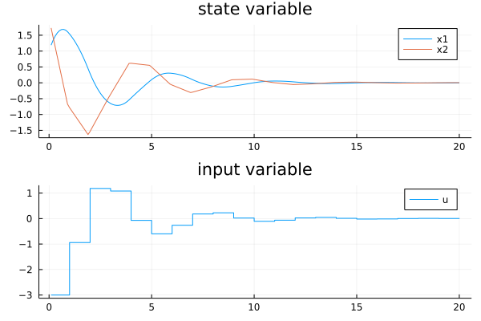
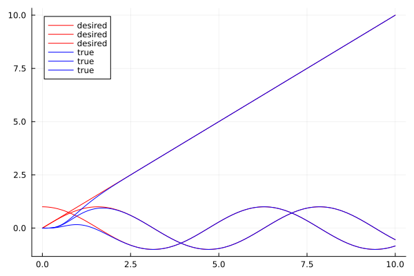

# FlightSims
[FlightSims.jl](https://github.com/JinraeKim/FlightSims.jl) is a general-purpose numerical simulator supporting nested environments and convenient macro-based data logging.

## Road map
- [x] Add ROS2 example (not urgent)

## NEWS
- See [NEWS.md](./NEWS.md).
### !! Breaking changes !!
- Both non-interactive and interactive simulation interfaces are now provided through the unified struct `Simulator`.
    - For more details, see [FSimBase.jl](https://github.com/JinraeKim/FSimBase.jl).
    - `sim` is deprecated; renamed as `solve`.
- A related package for ROS2 has been released: [FSimROS.jl](https://github.com/JinraeKim/FSimROS.jl).
    - with very few number of tests though.
    - default setting: not exported from FlightSims.jl.


## APIs
Main APIs can be found in [FSimBase.jl](https://github.com/JinraeKim/FSimBase.jl).
In FlightSims.jl, the default differential equation (DE) solver is [`Tsit5()`](https://diffeq.sciml.ai/stable/#Solver-Algorithms) for ordinary DE (ODE).

## Features
If you want more functionality, please feel free to report an issue!

### Nested Environments and Zoo
- Environments usually stand for **dynamical systems** but also include **other utilities**, for example, controllers.
- One can generate user-defined nested environments using provided APIs.
Also, some predefined environments are provided for reusability.
Take a look at [FSimZoo.jl](https://github.com/JinraeKim/FSimZoo.jl).

### Utilities
- Some utilities are also provided for dynamical system simulation.
- Examples include
    - **Simulation rendering**
        - See [FSimPlots.jl](https://github.com/JinraeKim/FSimPlots.jl). Note that FSimPlots.jl is not exported in the default setting to reduce precompilation time.
    <!-- - **Function approximator** -->
    <!--     - (Approximator) `LinearApproximator`, `PolynomialBasis` -->
    - **ROS2 compatibility**
        - See [FSimROS.jl](https://github.com/JinraeKim/FSimROS.jl). Note that FSimROS.jl is not exported in the default setting.


# Examples
## Basic
### Minimal examples
- For minimal examples of FlightSims.jl,
see [FSimBase.jl](https://github.com/JinraeKim/FSimBase.jl).


### Discrete problem
- See `test/environments/basics/discrete_problem.jl`.
```julia
using DifferentialEquations


function main()
    t0, tf = 0, 10
    x0 = [1.0, 2, 3]
    """
    dx: next x
    """
    @Loggable function dynamics!(dx, x, p, t; u)
        @log x
        dx .= 0.99*x + u
        @onlylog u_next = dx
    end
    simulator = Simulator(x0, apply_inputs(dynamics!; u=zeros(3));
                          Problem=:Discrete,
                          tf=tf,  # default step length = 1 for Discrete problem
                         )
    df = solve(simulator)
end
```

```julia
julia> main()
11×2 DataFrame
 Row │ time     sol
     │ Float64  NamedTup…
─────┼────────────────────────────────────────────
   1 │     0.0  (u_next = [0.99, 1.98, 2.97], x …
   2 │     1.0  (u_next = [0.9801, 1.9602, 2.940…
   3 │     2.0  (u_next = [0.970299, 1.9406, 2.9…
   4 │     3.0  (u_next = [0.960596, 1.92119, 2.…
   5 │     4.0  (u_next = [0.95099, 1.90198, 2.8…
   6 │     5.0  (u_next = [0.94148, 1.88296, 2.8…
   7 │     6.0  (u_next = [0.932065, 1.86413, 2.…
   8 │     7.0  (u_next = [0.922745, 1.84549, 2.…
   9 │     8.0  (u_next = [0.913517, 1.82703, 2.…
  10 │     9.0  (u_next = [0.904382, 1.80876, 2.…
  11 │    10.0  (u_next = [0.895338, 1.79068, 2.…
```

## Dynamical system control
### Optimal control and reinforcement learning
- For an example of **infinite-horizon continuous-time linear quadratic regulator (LQR)** with callbacks,
see the following example code (`test/environments/basics/lqr.jl`).

```julia
using FlightSims
const FS = FlightSims
using DifferentialEquations
using LinearAlgebra
using Plots
using Test
using Transducers


function main()
    # linear system
    A = [0 1;
         0 0]  # 2 x 2
    B = [0 1]'  # 2 x 1
    n, m = 2, 1
    env = LinearSystem(A, B)  # exported from FlightSims
    x0 = State(env)([1.0, 2.0])
    p0 = zero.(x0)  # auxiliary parameter
    # optimal control
    Q = Matrix(I, n, n)
    R = Matrix(I, m, m)
    lqr = LQR(A, B, Q, R)  # exported from FlightSims
    u_lqr = Command(lqr)  # (x, p, t) -> -K*x; minimise J = ∫ (x' Q x + u' R u) from 0 to ∞

    # simulation
    tf = 10.0
    Δt = 0.01
    affect!(integrator) = integrator.p = copy(integrator.u)  # auxiliary callback funciton
    cb = PeriodicCallback(affect!, Δt; initial_affect=true)  # auxiliary callback
    @Loggable function dynamics!(dx, x, p, t)
        @onlylog p  # activate this line only when logging data
        u = u_lqr(x)
        @log x, u
        @nested_log Dynamics!(env)(dx, x, p, t; u=u)  # exported `state` and `input` from `Dynamics!(env)`
    end
    simulator = Simulator(x0, dynamics!, p0;
                          tf=tf)
    df = solve(simulator; callback=cb, savestep=Δt)
    ts = df.time
    xs = df.sol |> Map(datum -> datum.x) |> collect
    us = df.sol |> Map(datum -> datum.u) |> collect
    ps = df.sol |> Map(datum -> datum.p) |> collect
    states = df.sol |> Map(datum -> datum.state) |> collect
    inputs = df.sol |> Map(datum -> datum.input) |> collect
    @test xs == states
    @test us == inputs
    p_x = plot(ts, hcat(states...)';
               title="state variable", label=["x1" "x2"], color=[:black :black], lw=1.5,
              )  # Plots
    plot!(p_x, ts, hcat(ps...)';
          ls=:dash, label="param", color=[:red :orange], lw=1.5
         )
    p_u = plot(ts, hcat(inputs...)'; title="control input", label="u")  # Plots
    fig = plot(p_x, p_u; layout=(2, 1))
    savefig(fig, "figures/lqr.png")
    display(fig)
    df
end

@testset "lqr example" begin
    main()
end
```

```julia
julia> main()
1001×2 DataFrame
  Row │ time     sol
      │ Float64  NamedTup…
──────┼────────────────────────────────────────────
    1 │    0.0   (p = [1.01978, 1.95564], state =…
    2 │    0.01  (p = [1.01978, 1.95564], state =…
    3 │    0.02  (p = [1.03911, 1.91186], state =…
    4 │    0.03  (p = [1.05802, 1.86863], state =…
    5 │    0.04  (p = [1.07649, 1.82596], state =…
  ⋮   │    ⋮                     ⋮
  998 │    9.97  (p = [-0.00093419, 0.00103198], …
  999 │    9.98  (p = [-0.000923913, 0.00102347],…
 1000 │    9.99  (p = [-0.00091372, 0.001015], st…
 1001 │   10.0   (p = [-0.00091372, 0.001015], st…
                                   992 rows omitted
```


### Linear system with zero-order-hold (ZOH) input
- Note that this example utilises interactive simulation interface. See `test/environments/integrated_environments/linear_system_zoh_input.jl`.

```julia
using FlightSims
import FlightSims: State, Dynamics!
using DataFrames
using ComponentArrays
using UnPack
using Transducers
using Plots
using SciMLBase
using Test


struct LinearSystem_ZOH_Input <: AbstractEnv
    linear_env::LinearSystem
end

function State(env::LinearSystem_ZOH_Input)
    State(env.linear_env)
end

function Dynamics!(env::LinearSystem_ZOH_Input)
    @Loggable function dynamics!(dx, x, input, t)
        @nested_log Dynamics!(env.linear_env)(dx, x, nothing, t; u=input)
    end
end

function main()
    A = [0 1;
         0 0]
    B = [0 1]'
    linear_env = LinearSystem(A, B)
    env = LinearSystem_ZOH_Input(linear_env)
    x0_state = [1, 2]
    input = zeros(1)
    x0 = State(env)(x0_state)
    t0 = 0.0
    tf = 20.0
    simulator = Simulator(x0, Dynamics!(env), input; tf=tf)
    # interactive sim
    Δt = 0.1  # save period
    df = DataFrame()
    @time for (i, t) in enumerate(t0:Δt:tf)
        # To perform interactive simulation,
        # you should be aware of the integrator interface
        # provided by DifferentialEquations.jl;
        # see https://diffeq.sciml.ai/stable/basics/integrator/#integrator
        # e.g., DO NOT directly change the integrator state
        state = simulator.integrator.u
        input = simulator.integrator.p
        if (i-1) % 10 == 0  # update input period
            input .= -sum(state)
        end
        step_until!(simulator, t, df)
    end
    # plot
    ts = df.time
    states = df.sol |> Map(datum -> datum.state) |> collect
    inputs = df.sol |> Map(datum -> datum.input) |> collect
    p_x = plot(ts, hcat(states...)';
               title="state variable", label=["x1" "x2"],
              )
    p_u = plot(ts, hcat(inputs...)';
               title="input variable", label="u",
               linetype=:steppost,  # to plot zero-order-hold input appropriately
              )
    fig = plot(p_x, p_u; layout=(2, 1))
    savefig("figures/interactive_sim.png")
    display(fig)
end


@testset "linear_system_zoh_input" begin
    main()
end
```


### Multicopter position control
- For an example of **backstepping position tracking controller for quadcopters**,
see `test/environments/integrated_environments/backstepping_position_controller_static_allocator_multicopter_env.jl`.


## Visualisation
### Missile guidance with interactive visualisation
- See `test/pluto_guidance.jl` (thanks to [@nhcho91](https://github.com/nhcho91)).


### Multicopter rendering
- For more details, see [FSimPlots.jl](https://github.com/JinraeKim/FSimPlots.jl).


## Examples with ROS2
See [FSimROS.jl](https://github.com/JinraeKim/FSimROS.jl).


## Related packages
### FSim family
- [FSimBase.jl](https://github.com/JinraeKim/FSimBase.jl) is
the lightweight base package for numerical simulation supporting nested dynamical systems and macro-based data logger. For more functionality, see FlightSims.jl.
- [FSimZoo.jl](https://github.com/JinraeKim/FSimZoo.jl)
contains predefined environments and controllers for FlightSims.jl.
- [FSimPlots.jl](https://github.com/JinraeKim/FSimPlots.jl) is
the plotting package for predefined environments exported from FlightSims.jl
- [FSimROS.jl](https://github.com/JinraeKim/FSimROS.jl) is
a package of FlightSims.jl family for ROS2.

### Packages using FlightSims.jl
- [FaultTolerantControl.jl](https://github.com/JinraeKim/FaultTolerantControl.jl):
fault tolerant control (FTC) with various models and algorithms of faults, fault detection and isolation (FDI), and reconfiguration (R) control.
- [FlightGNC.jl](https://github.com/nhcho91/FlightGNC.jl) ([@nhcho91](https://github.com/nhcho91)):
FlightGNC.jl is a Julia package containing GNC algorithms for autonomous systems.

### Useful packages
- It is highly based on [DifferentialEquations.jl](https://github.com/SciML/DifferentialEquations.jl) but mainly focusing on ODE (ordinary differential equations).
- The construction of nested environments are based on [ComponentArrays.jl](https://github.com/jonniedie/ComponentArrays.jl).
- The structure of the resulting data from simulation result is based on [DataFrames.jl](https://github.com/JuliaData/DataFrames.jl).
- Logging tool is based on [SimulationLogger.jl](https://github.com/JinraeKim/SimulationLogger.jl).

## Trouble shootings
### `solve` produces an empty Dataframe
- Please check whether you put `@Loggable` in front of the dynamics function in a proper way, e.g.,
```julia
function Dynamics!(env::MyEnv)
    @Loggable function dynamics!(dx, x, p, t; u)
    # return @Loggable dynamics!(dx, x, p, t; u)  # This would not work
        # blahblah...
    end
end
```

### `@Loggable` does not work; `ERROR: LoadError: LoadError: LoadError: LoadError: LoadError: LoadError: KeyError: key :name not found`
- Please check whether you assigned a name of function annotated by `@Loggable`, e.g.,
```julia
function Dynamics!(env::YourEnv)
    @Loggable function dynamics!(dX, X, p, ; u)
        ...
    end
end
```

instead of

```julia
function Dynamics!(env::YourEnv)
    @Loggable function (dX, X, p, ; u)
        ...
    end
end
```
